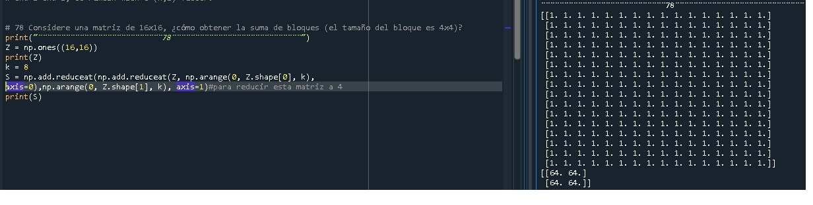
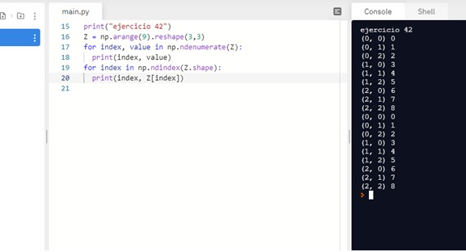
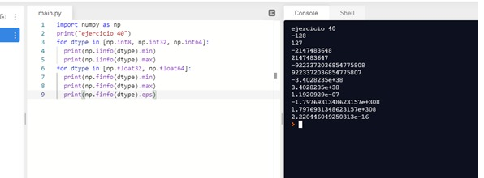
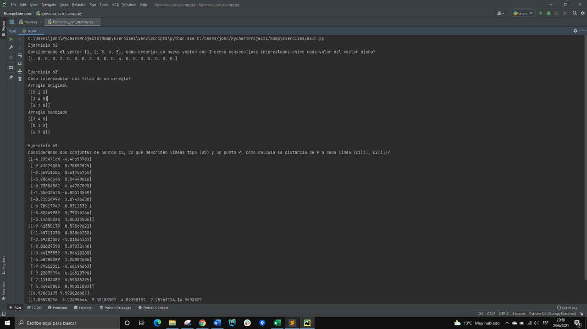
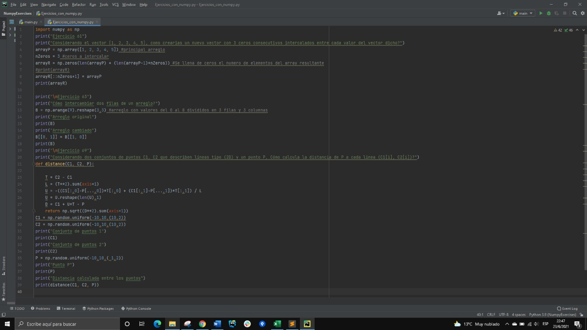
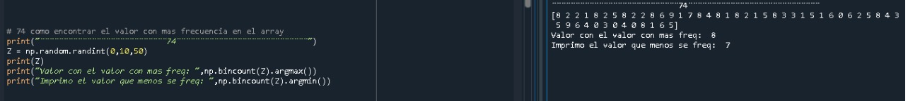

# Bienvenido a los ejercicios
### Name: Guillermo Andrade


```c++
#include "iostream"

using namespace std;

int main()
{
    cout << "Hola Mundo" << " A continuación veras los ejercicios realizados que los difrutes: " << "\n";
    return 0;
}
```








### :racehorse: 